> 实验使用资源：正点原子F1
>
> USART1：PA9P、A10（串口打印调试）
>
> USART3：PB10、PB11（WiFi模块）
>
> DHT11：PG11（采集数据、上报）
>
> LED0、1：PB5、PE5（介绍命令，控制亮灭）
>
> 显示屏（可有可无）

# HAL库创建工程

参考之前的博客：[STM32CubeMX安装_stm32cubemx下载-CSDN博客](https://blog.csdn.net/qq_61228493/article/details/129995099)

# ESP8266固件烧录

参考之前的博客：[ESP8266连接阿里云_esp8266+阿里云-CSDN博客](https://blog.csdn.net/qq_61228493/article/details/131135454)

# 阿里云创建物模型

参考之前的博客：[ESP8266连接阿里云_esp8266+阿里云-CSDN博客](https://blog.csdn.net/qq_61228493/article/details/131135454)

# 模块移植

> 这里主要说usart模块和WiFi相关模块，其他模块的驱动很简单，不再描述

## usart模块

1. 将【stm32f1xx_it.c】里面的`void USART1_IRQHandler(void)` 和`void USART3_IRQHandler(void)`函数注释掉

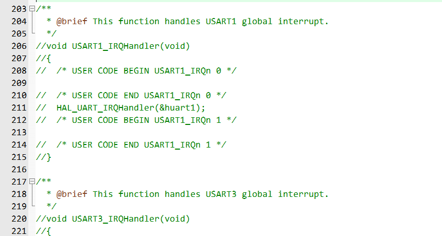

2. 将下面的代码粘贴到【usart.c】中的最下面的`/* USER CODE BEGIN 1 */`和`/* USER CODE END 1 */`之间

```c
/**
 * @brief       ATK-MW8266D UART printf
 * @param       fmt: 待打印的数据
 * @retval      无
 */
void atk_mw8266d_uart_printf(char *fmt, ...)
{
    va_list ap;
    uint16_t len;
    
    va_start(ap, fmt);
    vsprintf((char *)g_uart_tx_buf, fmt, ap);
    va_end(ap);
    
    len = strlen((const char *)g_uart_tx_buf);
    HAL_UART_Transmit(&huart3, g_uart_tx_buf, len, HAL_MAX_DELAY);
}

/**
 * @brief       ATK-MW8266D UART重新开始接收数据
 * @param       无
 * @retval      无
 */
void atk_mw8266d_uart_rx_restart(void)
{
    g_uart_rx_frame.sta.len     = 0;
    g_uart_rx_frame.sta.finsh   = 0;
}

/**
 * @brief       获取ATK-MW8266D UART接收到的一帧数据
 * @param       无
 * @retval      NULL: 未接收到一帧数据
 *              其他: 接收到的一帧数据
 */
uint8_t *atk_mw8266d_uart_rx_get_frame(void)
{
    if (g_uart_rx_frame.sta.finsh == 1)
    {
        g_uart_rx_frame.buf[g_uart_rx_frame.sta.len] = '\0';
        return g_uart_rx_frame.buf;
    }
    else
    {
        return NULL;
    }
}

/**
 * @brief       获取ATK-MW8266D UART接收到的一帧数据的长度
 * @param       无
 * @retval      0   : 未接收到一帧数据
 *              其他: 接收到的一帧数据的长度
 */
uint16_t atk_mw8266d_uart_rx_get_frame_len(void)
{
    if (g_uart_rx_frame.sta.finsh == 1)
    {
        return g_uart_rx_frame.sta.len;
    }
    else
    {
        return 0;
    }
}


void USART1_IRQHandler(void)
{
#if SYS_SUPPORT_OS                                                   /* 使用OS */
    OSIntEnter();
#endif
    HAL_UART_IRQHandler(&huart1);                               /* 调用HAL库中断处理公用函数 */

    while (HAL_UART_Receive_IT(&huart1, (uint8_t *)g_rx_buffer, RXBUFFERSIZE) != HAL_OK)     /* 重新开启中断并接收数据 */
    {
        /* 如果出错会卡死在这里 */
    }

#if SYS_SUPPORT_OS                                                   /* 使用OS */
    OSIntExit();
#endif
}

void USART3_IRQHandler(void)
{
  /* USER CODE BEGIN USART3_IRQn 0 */

  /* USER CODE END USART3_IRQn 0 */
  HAL_UART_IRQHandler(&huart3);
  /* USER CODE BEGIN USART3_IRQn 1 */
    uint8_t tmp;
    
    if (__HAL_UART_GET_FLAG(&huart3, UART_FLAG_ORE) != RESET)        /* UART接收过载错误中断 */
    {
        __HAL_UART_CLEAR_OREFLAG(&huart3);                           /* 清除接收过载错误中断标志 */
        (void)huart3.Instance->SR;                                   /* 先读SR寄存器，再读DR寄存器 */
        (void)huart3.Instance->DR;
    }
    
    if (__HAL_UART_GET_FLAG(&huart3, UART_FLAG_RXNE) != RESET)       /* UART接收中断 */
    {
        HAL_UART_Receive(&huart3, &tmp, 1, HAL_MAX_DELAY);           /* UART接收数据 */
        if (g_uart_rx_frame.sta.len < (256 - 1))   /* 判断UART接收缓冲是否溢出
                                                                             * 留出一位给结束符'\0'
                                                                             */
        {
            g_uart_rx_frame.buf[g_uart_rx_frame.sta.len] = tmp;             /* 将接收到的数据写入缓冲 */
            g_uart_rx_frame.sta.len++;                                      /* 更新接收到的数据长度 */
        }
        else                                                                /* UART接收缓冲溢出 */
        {
            g_uart_rx_frame.sta.len = 0;                                    /* 覆盖之前收到的数据 */
            g_uart_rx_frame.buf[g_uart_rx_frame.sta.len] = tmp;             /* 将接收到的数据写入缓冲 */
            g_uart_rx_frame.sta.len++;                                      /* 更新接收到的数据长度 */
        }
    }
    
    if (__HAL_UART_GET_FLAG(&huart3, UART_FLAG_IDLE) != RESET)       /* UART总线空闲中断 */
    {
        g_uart_rx_frame.sta.finsh = 1;                                      /* 标记帧接收完成 */
        
        __HAL_UART_CLEAR_IDLEFLAG(&huart3);                          /* 清除UART总线空闲中断 */
    }
  /* USER CODE END USART3_IRQn 1 */
}
```

3. 在【usart.c】上面的的`/* USER CODE BEGIN 0 */`和`/* USER CODE END 0 */`之间加入下面的代码

```c
#include <stdarg.h>
#include <stdio.h>
#include <string.h>


#if 1
#pragma import(__use_no_semihosting)             
//标准库需要的支持函数                 
struct __FILE 
{ 
	int handle; 

}; 

FILE __stdout;       
//定义_sys_exit()以避免使用半主机模式    
void _sys_exit(int x) 
{ 
	x = x; 
} 
//重定义fputc函数 
int fputc(int ch, FILE *f)
{      
	while((USART1->SR&0X40)==0);//循环发送,直到发送完毕   
    USART1->DR = (uint8_t) ch;      
	return ch;
}
#endif 

uint8_t g_rx_buffer[RXBUFFERSIZE];  /* HAL库使用的串口接收缓冲 */
```

4. 在【usart.c】中的`void HAL_UART_MspInit(UART_HandleTypeDef* uartHandle)`函数中调整中断优先级，WiFi的usart3的高于串口的，同时添加usar使能

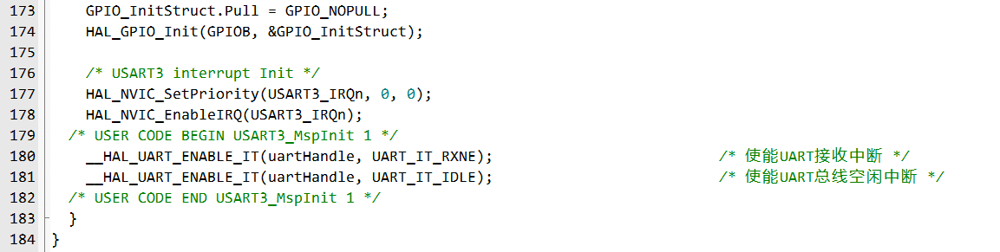

5. 在【usart.h】中的`/* USER CODE BEGIN Private defines */`和`/* USER CODE END Private defines */`之间加入下面的代码

```c
static struct
{
    uint8_t buf[256];              /* 帧接收缓冲 */
    struct
    {
        uint16_t len    : 15;                               /* 帧接收长度，sta[14:0] */
        uint16_t finsh  : 1;                                /* 帧接收完成标志，sta[15] */
    } sta;                                                  /* 帧状态信息 */
} g_uart_rx_frame = {0};                                    /* ATK-MW8266D UART接收帧缓冲信息结构体 */
static uint8_t g_uart_tx_buf[1024]; /* ATK-MW8266D UART发送缓冲 */
#define RXBUFFERSIZE   1                        /* 缓存大小 */
```

6. 在【usart.h】中的`/* USER CODE BEGIN Prototypes */`和`/* USER CODE END Prototypes */`之间加入下面的代码

```c
void atk_mw8266d_uart_printf(char *fmt, ...);       /* ATK-MW8266D UART printf */
void atk_mw8266d_uart_rx_restart(void);             /* ATK-MW8266D UART重新开始接收数据 */
uint8_t *atk_mw8266d_uart_rx_get_frame(void);       /* 获取ATK-MW8266D UART接收到的一帧数据 */
uint16_t atk_mw8266d_uart_rx_get_frame_len(void);   /* 获取ATK-MW8266D UART接收到的一帧数据的长度 */
```

## WiFi模块

1. 将编写好的`esp8266.c/.h`及`wifi.c/.h`文件分别加入Src和Inc文件夹，然后再在keil里将`wifi.c`文件加入工程

2. 在`wifi.h`中，修改WiFi信息和阿里云物联网平台相关参数

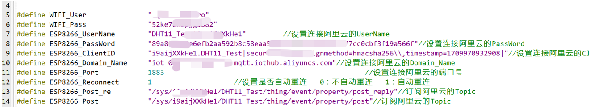

> **这里需要注意ESP8266_ClientID里面的的`,`需要进行转义**

## 增大初始栈大小

在启动文件startup_stm32f103xe.s中，将Heap Size的大小调大，不然使用cJSON后，可能烧完程序开发板都没反应

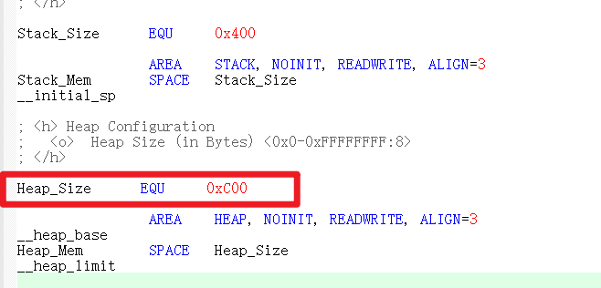

# 连接阿里云

1. 在`main.c`中引用`wifi.h`
2. 调用`wifi_init();`

3. 打开串口助手，观察打印的数据，同时查看阿里云平台设备是否在线
4. 连上云平台后，需要将采集的数据进行上报，同时接收下发的指令（在后面介绍使用cJSON实现）

> 连不上云平台的原因：
>
> - 参数没写对，特别是ESP8266_ClientID这个参数
> - 网络不好，特别是在实验室同时很多人开热点，严重干扰连接

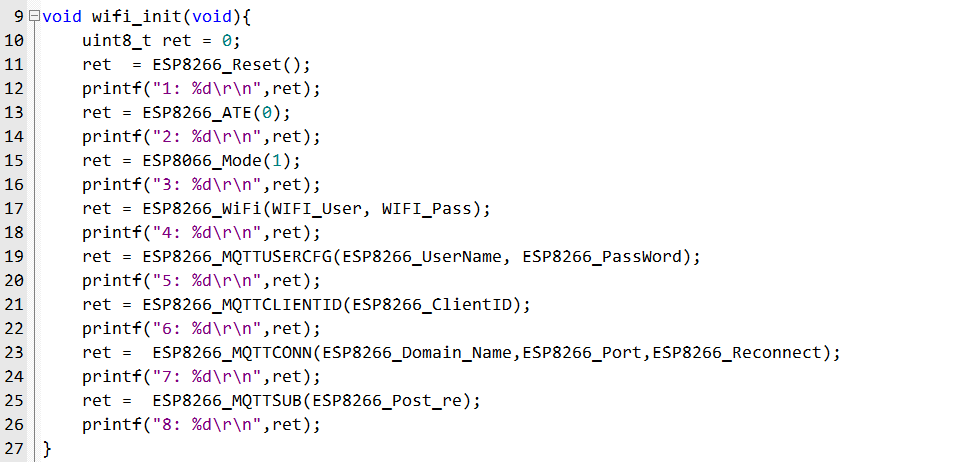

# cJSON模块

## JSON格式

JSON是一种轻量级的数据交换格式，可读性强、编写简单。键值对组合编写规则，键名使用双引号包裹，冒号：分隔符后面紧跟着数值，有两种常用的数据类型是对象和数组。

对象：使用花括号{}包裹起来的内容，数据结构{"key1":"value1","key2":"value2"......}，key为对象的属性，value为对象的值。

数值：使用中括号[]包裹起来的内容，数据结构{"key":["value1","value2","value3"......]}。

## 下载

下载地址：[cJSON download | SourceForge.net](https://sourceforge.net/projects/cjson/)

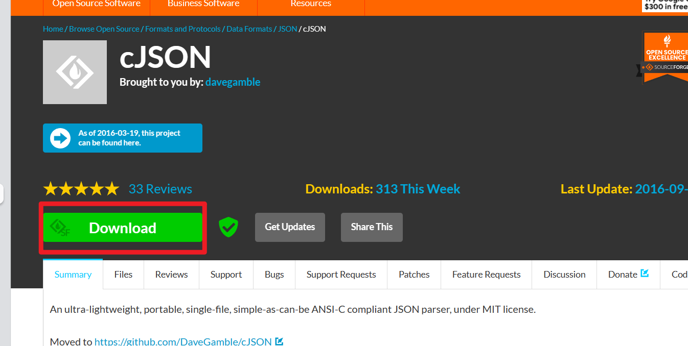

## 移植

1. 将压缩包解压，打开cJSON文件夹，只保留`cJSON.c`和`cJSON.h`，其他文件全部删除

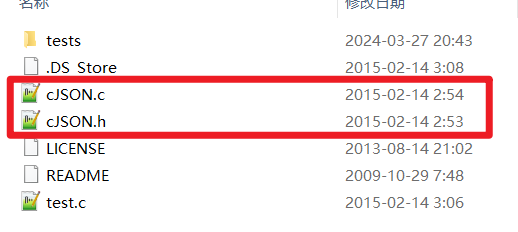

2. 将修改后的cJSON文件夹加入项目所在目录

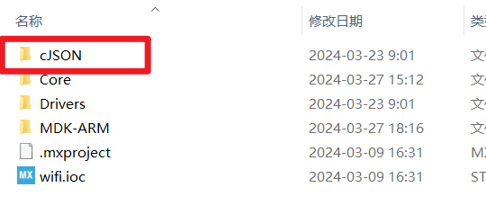

3. 将该文件夹添加进工程，点击【魔法棒】-【C/C++】-【IncludePaths】中将路径加入

> 如果想省略3和4，可以直接将`cJSON.c`和`cJSON.h`分别放入Src和Inc文件夹，然后直接将`cJSON.c`加入工程即可

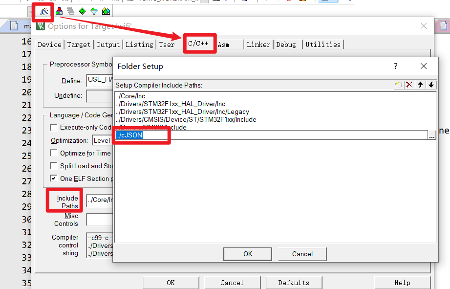

4. 将`cJSON.c`添加进工程，点击【方块】-【Project Items】，在groups中创建一个`cJSON`文件夹，然后再在里面放入`cJSON.c`

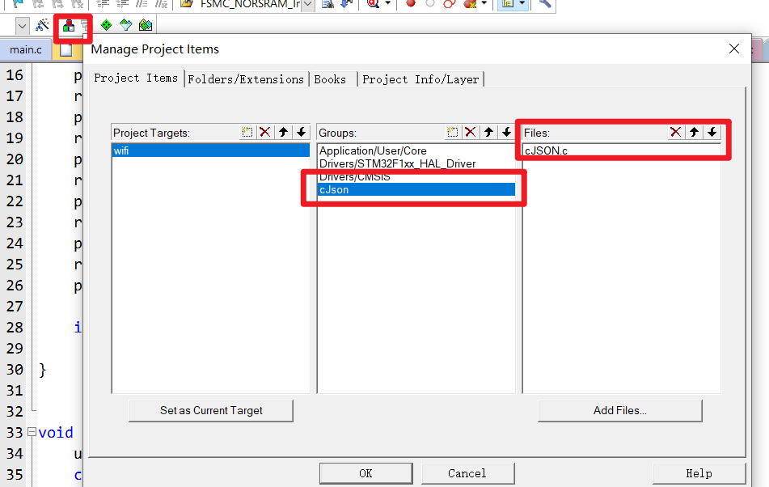

## 关键函数

- cJSON *cJSON_CreateObject(void)

  - 创建JSON结构对象

- cJSON *cJSON_CreateNumber(double num)

  - 创建一个整型的数据类型

- cJSON *cJSON_CreateString(const char *string)

  - 创建一个字符串数据类型

- cJSON *cJSON_CreateArray(void)

  - 创建一个数组数据类型函数：

- cJSON *cJSON_CreateIntArray(const int *numbers, int count)

  - 将多个整型数据类型增加到数组中

- cJSON *cJSON_Parse(const char *value)
  - 从JSON文件数据缓冲区解析JSON的对象结构，使用完成后要必须要释放对象结构

- void cJSON_Delete(cJSON *c)
  - 释放申请的JSON结构缓存空间

- void cJSON_AddItemToObject(cJSON *json, cJSON *, cJSON_CreateArray())
  - 向对象中增加对象

- cJSON *cJSON_GetObjectItem(cJSON *object, const char *string)
  - 根据键名在JSON中查找子节点

# 上报消息

> 当在物联网平台为产品定义物模型后，设备需要按照Alink JSON格式上报属性或事件
>
> Alink协议是针对物联网开发领域设计的一种数据交换规范，数据格式是JSON，用于设备端和物联网平台的双向通信，更便捷地实现和规范了设备端和物联网平台之间的业务数据交互

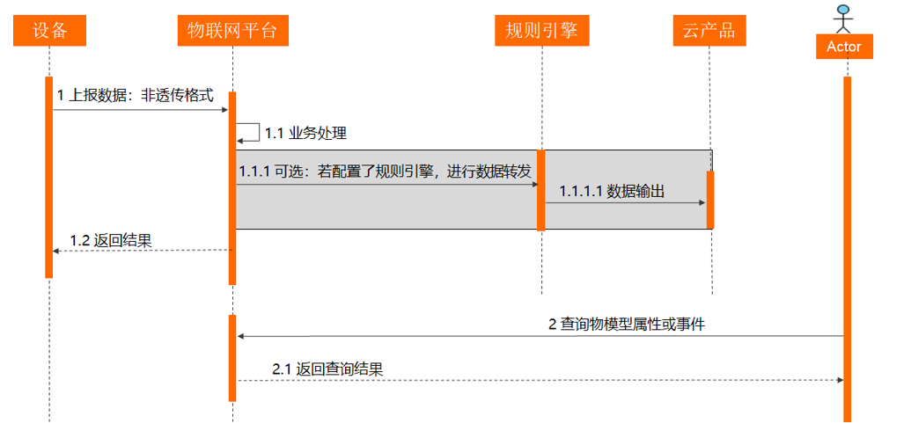

1. 先看一下官方给的数据上报的格式

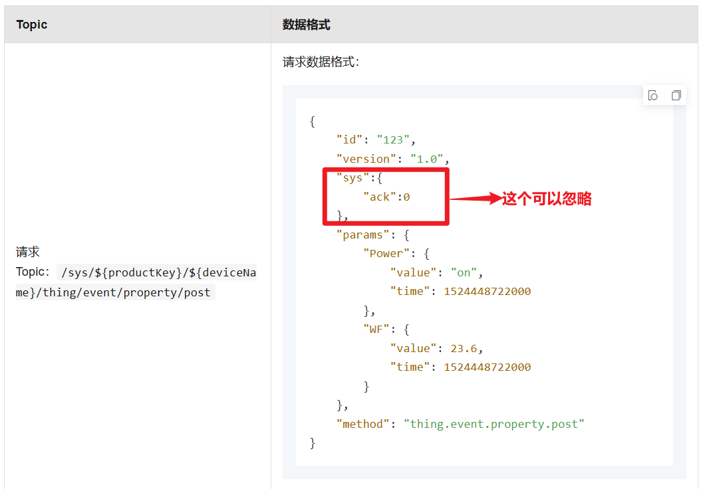

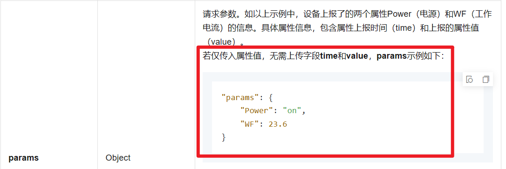

2. 我们必须要传的就是method、id、version、params这四个组成的JSON字符串，其中params传输的内容也是个小的JSON字符串
3. 根据这个我们使用cJSON进行JSON格式的封装

- 创建两个JSON对象，外部和内部

```c
cJSON *json = cJSON_CreateObject(); // 创建一个空的JSON对象
cJSON *params_cjson = cJSON_CreateObject(); // 创建一个空的子JSON对象
```

- 封装params键对应的值，也就是内部的JSON【这个里面的键名和阿里云上定义的要保持一致】

```c
cJSON_AddNumberToObject(params_cjson, "Humidity", humidity);
cJSON_AddNumberToObject(params_cjson, "temperature", temperature);
cJSON_AddNumberToObject(params_cjson, "LEDSwitch", LED_Switch);
```


- 封装外部大的JSON【消息ID号。取值范围0~4294967295，且每个消息ID在当前设备中具有唯一性】

```c
cJSON_AddItemToObject(json, "method", cJSON_CreateString("thing.service.property.post"));
cJSON_AddItemToObject(json, "id", cJSON_CreateString("99119635"));
cJSON_AddItemToObject(json, "params", params_cjson);
cJSON_AddItemToObject(json, "version", cJSON_CreateString("1.0.0"));
```

4. JSON格式封装好后，对里面的内容进行处理，主要是对`,`进行转义

```c
// 将JSON对象转换为无格式的字符串
str = cJSON_PrintUnformatted(json);

// 为MQTT发布添加转义字符
for(i = 0; *str != '\0'; i++){
    params_buf[i] = *str;
    // 如果下一个字符是引号或逗号，添加转义字符
    if(*(str + 1) == '"' || *(str + 1) == ','){
        params_buf[++i] = '\\';
    }
    str++;
    move_num++;
}
str = str - move_num; // 回退指针到JSON字符串的开始
```

5. 上报消息，同时清除内存

```c
// 构建AT命令
sprintf((char *)cmd,"AT+MQTTPUB=0,\""ESP8266_Post"\",\"%s\",0,0\r\n",params_buf);

// 发送AT命令并通过ESP8266模块
ESP8266_Sent_AT(cmd, "OK", 500);

// 清理JSON对象占用的内存
cJSON_Delete(json);

// 如果分配了额外的字符串空间，释放它
if(str != NULL){
    free(str);
    str = NULL;
    printf("释放str空间成功\r\n");
}
```

> 一定要及时释放空间，cJSON不断使用malloc超级占内存

# 接收命令

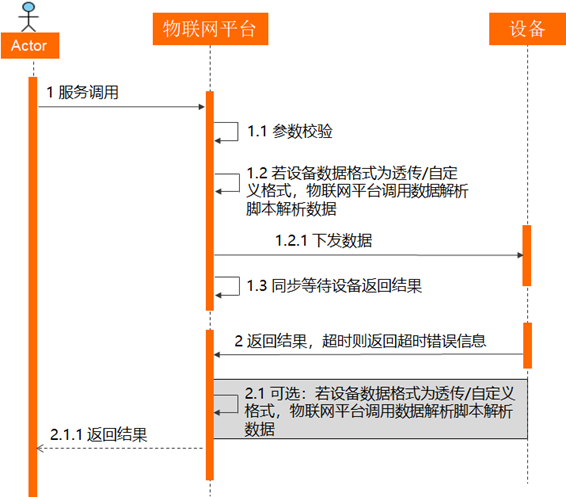

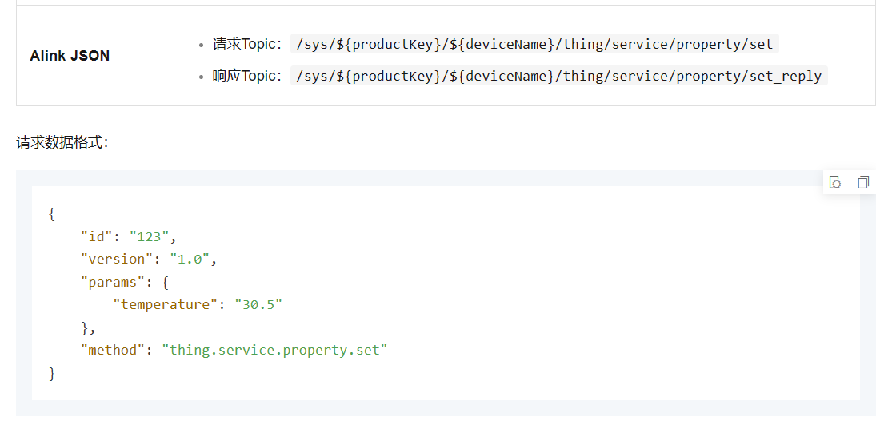

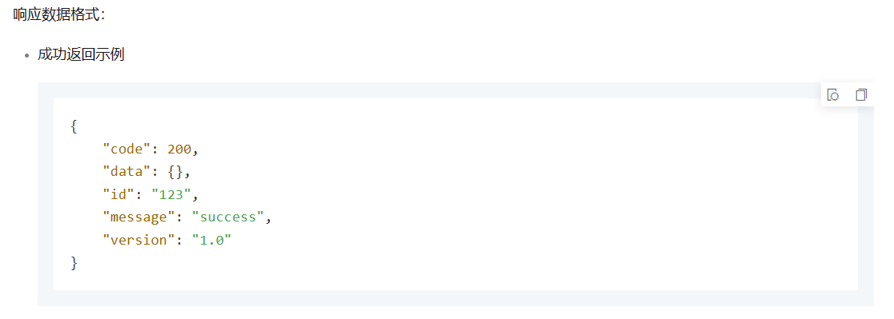

1. 这里需要介绍云端下发的指令，接收后成功发送成功的响应格式，失败发送失败的响应格式【这里只响应成功的】

2. 解析下发的JSON字符串，找到params中，需要的数据
3. 在介绍成功，获取到数据后，向云平台发送接受成功响应消息

```c
void rcv_json(void){
	uint8_t cmd[1024]; // 用于存储构建的AT命令
    uint8_t *ret = NULL; // 用于存储接收到的数据帧
    cJSON *cjson = NULL; // 用于存储解析后的JSON对象
	cJSON *re_json = NULL;
	char *str = NULL;
    char topic_buff[1024]; // 用于存储MQTT主题
    int num; // 用于存储接收数据的数量
    char recv_buffer[1024]; // 用于存储接收到的JSON数据
	uint8_t params_buf[1024]; // 用于存储处理过的JSON字符串
    uint16_t move_num = 0; // 用于记录字符串处理过程中的移动次数
	int i = 0; // 循环迭代变量
    
    ret = atk_mw8266d_uart_rx_get_frame(); // 获取UART接收到的数据帧
    atk_mw8266d_uart_rx_restart(); // 重启UART接收
	
    char *ptr_recv = strstr((const char *)ret,"+MQTTSUBRECV"); // 检查是否包含MQTT订阅数据标志
    
    if(ptr_recv!=NULL){ // 如果是MQTT订阅数据
        memset(topic_buff,0,sizeof(topic_buff)); // 清空主题缓冲区
        
        sscanf((char *)ret,"+MQTTSUBRECV:0,%[^,],%d,%s",topic_buff,&num,recv_buffer); // 解析数据，提取主题、数据数量和JSON数据
        
        if(strstr(topic_buff,ESP8266_SET)) { // 如果主题包含特定标记
            printf("接收数据成功，开始解析  %s\r\n",recv_buffer); // 打印接收到的数据
            cjson = cJSON_Parse(recv_buffer); // 解析JSON数据
			
        }
        
        if(cjson==NULL) // 如果JSON解析失败
            printf("cjson 解析错误\r\n"); // 打印错误信息
        else{
            cJSON *json_data = cJSON_GetObjectItem(cjson,"params"); // 获取JSON对象中的params项
            if(json_data==NULL){ // 如果params项不存在
                printf("cjson  没有数据\r\n"); // 打印错误信息
                return;
            }
            else{
                printf("cjson 内存大小为 = %d\r\n",sizeof(cjson)); // 打印JSON对象的内存大小
                // 解析数据
                if(cJSON_GetObjectItem(json_data,"LEDSwitch")!=NULL) // 如果存在LEDSwitch键
                {
                    LED_Switch = cJSON_GetObjectItem(json_data,"LEDSwitch")->valueint; // 提取LEDSwitch的值
                    printf("csjon解析成功 LED_Switch = %d\r\n",LED_Switch); // 打印LEDSwitch的值
					
					//接收响应
					//------
					sprintf((char *)cmd,"AT+MQTTPUB=0,\""ESP8266_Post_re"\",\"{\\\"code\\\": 200, \\\"data\\\": {}, \\\"id\\\": \\\"%s\\\", \\\"message\\\": \\\"success\\\", \\\"version\\\": \\\"1.0.0\\\"}\",0,0\r\n",cJSON_GetObjectItem(cjson,"id")->valuestring);
					printf("开始发送数据:%s\r\n", cmd);
					ESP8266_Sent_AT(cmd, "OK", 500);
                    //------
                }
            }
            cJSON_Delete(cjson); // 删除JSON对象，释放内存
			
			//接收响应
            cJSON_Delete(re_json);
			if(str != NULL){
				free(str);
				str = NULL;
				printf("释放str空间成功\r\n");
			}
        }
    }
}
```

源码地址：
