# STM32HAL库+ESP8266+cJSON+微信小程序_连接华为云物联网平台

> 实验使用资源：正点原子F407
>
> USART1：PA9P、A10（串口打印调试）
>
> USART3：PB10、PB11（WiFi模块）
>
> DHT11：PG9（采集数据、上报）
>
> LED0、1：PF9、PF10（根据收到的命令，控制亮灭）
>
> 显示屏（可有可无）

## 0 前置内容准备

以下内容请参考之前写过的博客

- HAL库创建工程【[STM32CubeMX安装_stm32cubemx下载-CSDN博客](https://blog.csdn.net/qq_61228493/article/details/129995099)】
- ESP8266固件烧录【[ESP8266烧录AT指令](https://blog.csdn.net/qq_61228493/article/details/131135545#t7)】

## 1 华为云物联网平台创建产品

### 1.1新建产品

1. 在华为云设备接入IoTDA平台，点击左上角的【创建产品】，参考下图填写产品信息。

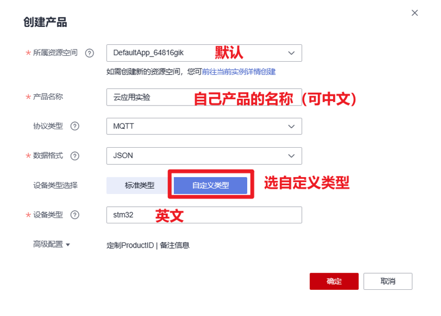

2. 创建完成后进入创建的产品，进行产品模型设置。首先先创建一个服务，服务ID自己根据实际写。
3. 点击【新增属性】，根据实际需求，添加需要交互的数据及其类型和访问方式。

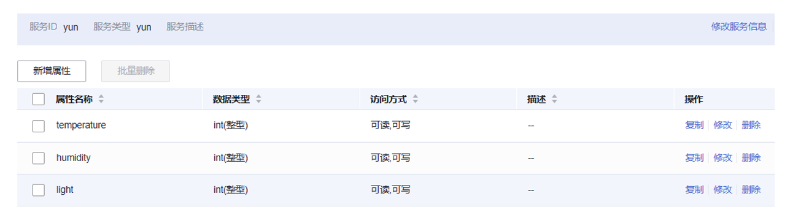

4. 点击【添加命令】，进行指令的设置，【下发参数】就是下发指令控制设备，【响应参数】就是读取设备上传信息。

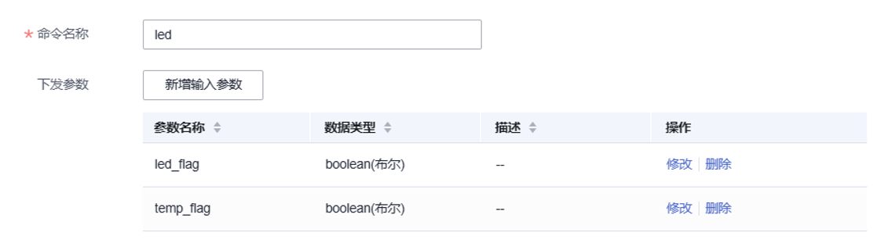

### 1.2 新建设备

在【所有设备】界面，点击的【注册设备】添加设备

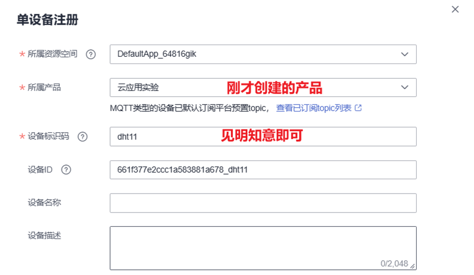

### 1.3 获取MQTT三元素

在新创建的设备中，点击查看MQTT连接参数，即可获取三元素

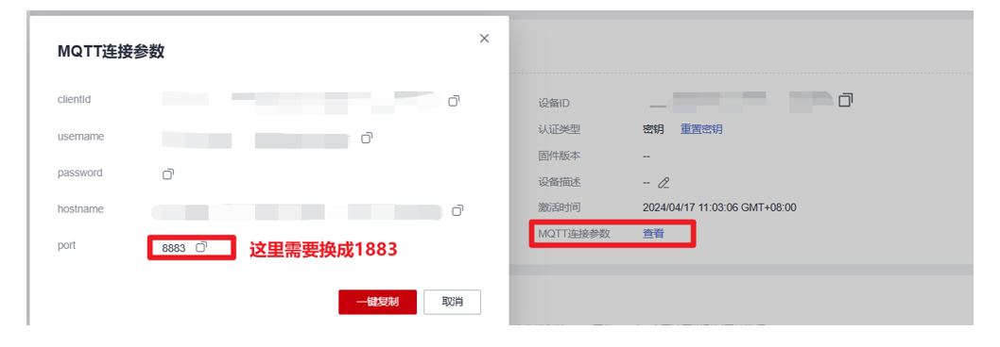

### 1.4 获取订阅Topic

在之前创建的产品中，Topic管理里面包含我们需要订阅的Topic

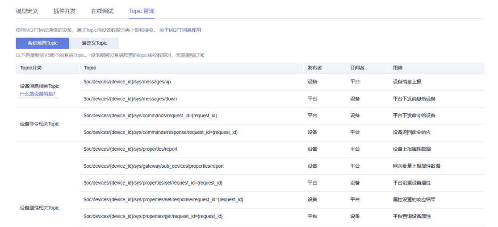

## 2 usart模块

1. 将【stm32f1xx_it.c】里面的`void USART1_IRQHandler(void)` 和`void USART3_IRQHandler(void)`函数注释掉

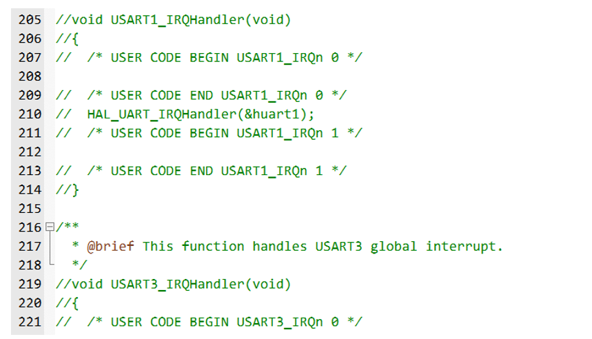

2. 将下面的代码粘贴到【usart.c】中的最下面的`/* USER CODE BEGIN 1 */`和`/* USER CODE END 1 */`之间

```c
/**
 * @brief       ATK-MW8266D UART printf
 * @param       fmt: 待打印的数据
 * @retval      无
 */
void atk_mw8266d_uart_printf(char *fmt, ...)
{
    va_list ap;
    uint16_t len;
    
    va_start(ap, fmt);
    vsprintf((char *)g_uart_tx_buf, fmt, ap);
    va_end(ap);
    
    len = strlen((const char *)g_uart_tx_buf);
    HAL_UART_Transmit(&huart3, g_uart_tx_buf, len, HAL_MAX_DELAY);
}

/**
 * @brief       ATK-MW8266D UART重新开始接收数据
 * @param       无
 * @retval      无
 */
void atk_mw8266d_uart_rx_restart(void)
{
    g_uart_rx_frame.sta.len     = 0;
    g_uart_rx_frame.sta.finsh   = 0;
}

/**
 * @brief       获取ATK-MW8266D UART接收到的一帧数据
 * @param       无
 * @retval      NULL: 未接收到一帧数据
 *              其他: 接收到的一帧数据
 */
uint8_t *atk_mw8266d_uart_rx_get_frame(void)
{
    if (g_uart_rx_frame.sta.finsh == 1)
    {
        g_uart_rx_frame.buf[g_uart_rx_frame.sta.len] = '\0';
        return g_uart_rx_frame.buf;
    }
    else
    {
        return NULL;
    }
}

/**
 * @brief       获取ATK-MW8266D UART接收到的一帧数据的长度
 * @param       无
 * @retval      0   : 未接收到一帧数据
 *              其他: 接收到的一帧数据的长度
 */
uint16_t atk_mw8266d_uart_rx_get_frame_len(void)
{
    if (g_uart_rx_frame.sta.finsh == 1)
    {
        return g_uart_rx_frame.sta.len;
    }
    else
    {
        return 0;
    }
}


void USART1_IRQHandler(void)
{
#if SYS_SUPPORT_OS                                                   /* 使用OS */
    OSIntEnter();
#endif
    HAL_UART_IRQHandler(&huart1);                               /* 调用HAL库中断处理公用函数 */

    while (HAL_UART_Receive_IT(&huart1, (uint8_t *)g_rx_buffer, RXBUFFERSIZE) != HAL_OK)     /* 重新开启中断并接收数据 */
    {
        /* 如果出错会卡死在这里 */
    }

#if SYS_SUPPORT_OS                                                   /* 使用OS */
    OSIntExit();
#endif
}

void USART3_IRQHandler(void)
{
  /* USER CODE BEGIN USART3_IRQn 0 */

  /* USER CODE END USART3_IRQn 0 */
  HAL_UART_IRQHandler(&huart3);
  /* USER CODE BEGIN USART3_IRQn 1 */
    uint8_t tmp;
    
    if (__HAL_UART_GET_FLAG(&huart3, UART_FLAG_ORE) != RESET)        /* UART接收过载错误中断 */
    {
        __HAL_UART_CLEAR_OREFLAG(&huart3);                           /* 清除接收过载错误中断标志 */
        (void)huart3.Instance->SR;                                   /* 先读SR寄存器，再读DR寄存器 */
        (void)huart3.Instance->DR;
    }
    
    if (__HAL_UART_GET_FLAG(&huart3, UART_FLAG_RXNE) != RESET)       /* UART接收中断 */
    {
        HAL_UART_Receive(&huart3, &tmp, 1, HAL_MAX_DELAY);           /* UART接收数据 */
        if (g_uart_rx_frame.sta.len < (256 - 1))   /* 判断UART接收缓冲是否溢出
                                                                             * 留出一位给结束符'\0'
                                                                             */
        {
            g_uart_rx_frame.buf[g_uart_rx_frame.sta.len] = tmp;             /* 将接收到的数据写入缓冲 */
            g_uart_rx_frame.sta.len++;                                      /* 更新接收到的数据长度 */
        }
        else                                                                /* UART接收缓冲溢出 */
        {
            g_uart_rx_frame.sta.len = 0;                                    /* 覆盖之前收到的数据 */
            g_uart_rx_frame.buf[g_uart_rx_frame.sta.len] = tmp;             /* 将接收到的数据写入缓冲 */
            g_uart_rx_frame.sta.len++;                                      /* 更新接收到的数据长度 */
        }
    }
    
    if (__HAL_UART_GET_FLAG(&huart3, UART_FLAG_IDLE) != RESET)       /* UART总线空闲中断 */
    {
        g_uart_rx_frame.sta.finsh = 1;                                      /* 标记帧接收完成 */
        
        __HAL_UART_CLEAR_IDLEFLAG(&huart3);                          /* 清除UART总线空闲中断 */
    }
  /* USER CODE END USART3_IRQn 1 */
}
```

3. 在【usart.c】上面的的`/* USER CODE BEGIN 0 */`和`/* USER CODE END 0 */`之间加入下面的代码

```c
#include <stdarg.h>
#include <stdio.h>
#include <string.h>


#if 1
#pragma import(__use_no_semihosting)             
//标准库需要的支持函数                 
struct __FILE 
{ 
	int handle; 

}; 

FILE __stdout;       
//定义_sys_exit()以避免使用半主机模式    
void _sys_exit(int x) 
{ 
	x = x; 
} 
//重定义fputc函数 
int fputc(int ch, FILE *f)
{      
	while((USART1->SR&0X40)==0);//循环发送,直到发送完毕   
    USART1->DR = (uint8_t) ch;      
	return ch;
}
#endif 

uint8_t g_rx_buffer[RXBUFFERSIZE];  /* HAL库使用的串口接收缓冲 */
```

4. 在【usart.c】中的`void HAL_UART_MspInit(UART_HandleTypeDef* uartHandle)`函数中调整中断优先级，WiFi的usart3的高于串口的，同时添加usar使能

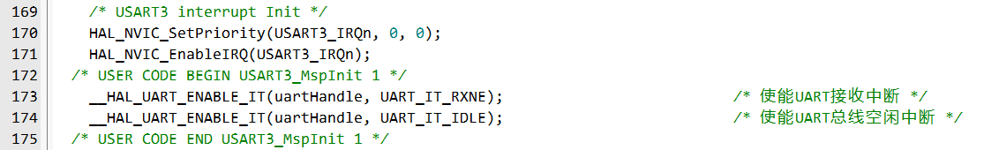

5. 在【usart.h】中的`/* USER CODE BEGIN Private defines */`和`/* USER CODE END Private defines */`之间加入下面的代码

```c
static struct
{
    uint8_t buf[256];              /* 帧接收缓冲 */
    struct
    {
        uint16_t len    : 15;                               /* 帧接收长度，sta[14:0] */
        uint16_t finsh  : 1;                                /* 帧接收完成标志，sta[15] */
    } sta;                                                  /* 帧状态信息 */
} g_uart_rx_frame = {0};                                    /* ATK-MW8266D UART接收帧缓冲信息结构体 */
static uint8_t g_uart_tx_buf[1024]; /* ATK-MW8266D UART发送缓冲 */
#define RXBUFFERSIZE   1                        /* 缓存大小 */
```

6. 在【usart.h】中的`/* USER CODE BEGIN Prototypes */`和`/* USER CODE END Prototypes */`之间加入下面的代码

```c
void atk_mw8266d_uart_printf(char *fmt, ...);       /* ATK-MW8266D UART printf */
void atk_mw8266d_uart_rx_restart(void);             /* ATK-MW8266D UART重新开始接收数据 */
uint8_t *atk_mw8266d_uart_rx_get_frame(void);       /* 获取ATK-MW8266D UART接收到的一帧数据 */
uint16_t atk_mw8266d_uart_rx_get_frame_len(void);   /* 获取ATK-MW8266D UART接收到的一帧数据的长度 */
```

##  3 WiFi模块

将提前编写好的`esp8266.c/.h`文件分别加入Src和Inc文件夹，然后再在keil里将`esp8266.c`文件加入工程。

## 4 CJSON模块移植

移植过程查看之前写的另一篇博客【[CJSON模块](https://blog.csdn.net/qq_61228493/article/details/138252055#t8)】

## 5 WIFI连接华为云

1. 创建wifi_HW.c/.h文件。
2. 在wifi_HW.h中宏定义连接华为云相关参数。

```c
// Wi-Fi用户名和密码
#define WIFI_User 						 "***"  // Wi-Fi网络名称
#define WIFI_Pass   					 "***"  // Wi-Fi网络密码

// ESP8266设备在华为云IoT平台的认证信息
#define ESP8266_UserName 				 "***"  // 用户名，通常为设备ID
#define ESP8266_PassWord				 "***"  // 密码或密钥
#define ESP8266_ClientID				 "***"  // MQTT客户端ID
#define ESP8266_Domain_Name				 "***"  // 华为云IoT平台的域名
#define ESP8266_Port 					 1883  // MQTT服务端口
#define ESP8266_Reconnect				 1  // 是否允许设备在断开连接后尝试重新连接

// 华为云MQTT服务相关设置
#define HUAWEI_MQTT_ServiceID			 "***"  // 服务ID
#define HUAWEI_MQTT_DeviceID	         "***"  // 设备ID
#define HUAWEI_MQTT_commands             "$oc/devices/***/sys/commands/#"  // 命令订阅主题
#define HUAWEI_MQTT_commands_response    "$oc/devices/***/sys/commands/response/request_id="  // 命令响应主题
#define HUAWEI_MQTT_report               "$oc/devices/***/sys/properties/report"  // 属性上报主题
```

3. 编写wifi_HW.c文件，调用esp8266.c中编写的函数连接华为云，然后将该函数名加入wifi_HW.h中。

```c
void wifi_init(void){
	uint8_t ret = 0;
	ret  = ESP8266_Reset();
	printf("1: %d\r\n",ret);
	ret = ESP8266_ATE(0);
	printf("2: %d\r\n",ret);
	ret = ESP8066_Mode(1);
	printf("3: %d\r\n",ret);
	ret = ESP8266_WiFi(WIFI_User, WIFI_Pass);
	printf("4: %d\r\n",ret);
	ret = ESP8266_MQTTUSERCFG(ESP8266_UserName, ESP8266_PassWord);
	printf("5: %d\r\n",ret);
	ret = ESP8266_MQTTCLIENTID(ESP8266_ClientID);
	printf("6: %d\r\n",ret);
	ret =  ESP8266_MQTTCONN(ESP8266_Domain_Name,ESP8266_Port,ESP8266_Reconnect);
	printf("7: %d\r\n",ret);
	ret =  ESP8266_MQTTSUB(HUAWEI_MQTT_commands);
	printf("8: %d\r\n",ret);
}
```

## 6 数据交互

### 6.1 设备属性上报

参考华为云官方给出的MQTT属性上报样例，在wifi_HW.c中编写`report_Json`函数，使用cJSON模块封装传感器数据，然后将其发送到云平台。

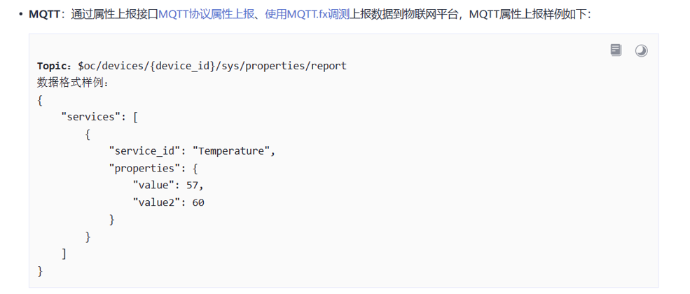

可以看出该消息的JSON格式：

(1)   在根对象中，有一个名为services的键，其值是一个数组。

(2)   在services数组中，有一个服务对象，它包含两个键：service_id和properties

(3)   在properties对象中，存放的键值对就是在产品中创建的属性。

根据这种格式，在`report_Json`函数中封装JSON消息

```c
void report_Json(uint8_t temperature, uint8_t humidity,uint8_t adcx){
    uint8_t cmd[1024]; // 用于存储构建的AT命令
    char *str = NULL; // 指向JSON字符串的指针
    int i = 0; // 循环迭代变量
    uint8_t params_buf[1024]; // 用于存储处理过的JSON字符串
    uint16_t move_num = 0; // 用于记录字符串处理过程中的移动次数
    
    cJSON *json = cJSON_CreateObject(); // 创建一个空的JSON对象
    cJSON *properties_cjson = cJSON_CreateObject(); // 创建一个空的子JSON对象，用于存储属性
    cJSON *service = cJSON_CreateObject(); // 创建一个空的子JSON对象，用于存储服务信息
    cJSON *services_array = cJSON_CreateArray(); // 创建一个空的JSON数组，用于存储服务数组
	
	// 向属性对象中添加温度、湿度和光照强度数据
    cJSON_AddNumberToObject(properties_cjson, "temperature", temperature);
    cJSON_AddNumberToObject(properties_cjson, "humidity", humidity);
	cJSON_AddNumberToObject(properties_cjson, "light", adcx);
    // 向服务对象中添加服务ID和属性
	cJSON_AddStringToObject(service, "service_id", "yun");
    cJSON_AddItemToObject(service, "properties", properties_cjson);
	cJSON_AddItemToObject(json, "services", services_array);
	 // 将服务数组添加到JSON对象中
	cJSON_AddItemToArray(services_array, service);
    
    // 将JSON对象转换为无格式的字符串
    str = cJSON_PrintUnformatted(json);
    
    // 打印JSON格式的字符串
    //printf("json格式 = %s\r\n", str);
    
    // 为MQTT发布添加转义字符
    for(i = 0; *str != '\0'; i++){
        params_buf[i] = *str;
        // 如果下一个字符是引号或逗号，添加转义字符
        if(*(str + 1) == '"' || *(str + 1) == ','){
            params_buf[++i] = '\\';
        }
        str++;
        move_num++;
    }
    str = str - move_num; // 回退指针到JSON字符串的开始
    
    // 打印处理过的JSON字符串
    //printf("params_buf = %s\r\n", params_buf);
    
    // 构建AT命令
    sprintf((char *)cmd,"AT+MQTTPUB=0,\""HUAWEI_MQTT_report"\",\"%s\",0,0\r\n",params_buf);
    
    // 打印即将发送的AT命令
    //printf("开始发送数据:%s", cmd);

    // 发送AT命令并通过ESP8266模块
    ESP8266_Sent_AT(cmd, "OK", 500);
    
    // 清理JSON对象占用的内存
    cJSON_Delete(json);
    
    // 如果分配了额外的字符串空间，释放它
    if(str != NULL){
        free(str);
        str = NULL;
        //printf("释放str空间成功\r\n");
    }
}
```

### 6.2 云端命令下发

参考华为云官方给出的MQTT下行请求样例，在wifi_HW.c中编写rcv_json函数，解析云平台下发的JSON消息字符串，如果成功接收后，需要给云平台返回接收成功的消息命令。

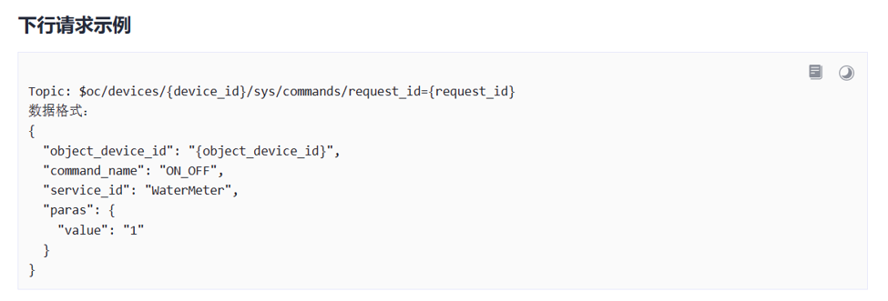

从给出的样例中可以看出，下发的指令在paras键所对应的JSON值中，只需分析其中的键的名字，然后读取相匹配的键的值，即可获取下发的命令。

参考下图响应参数的格式，可知响应参数只需发送订阅的topic和下发命令中的request_id的值即可，后面的JSON消息体均可省略。

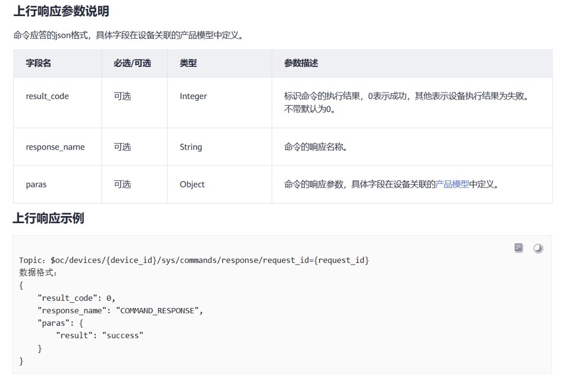

```c
void rcv_json(void){
    uint8_t *ret = NULL; // 用于存储接收到的数据帧
    cJSON *cjson = NULL; // 用于存储解析后的JSON对象
    char topic_buff[1024]; // 用于存储MQTT主题
    int num; // 用于存储接收数据的数量
    char recv_buffer[1024]; // 用于存储接收到的JSON数据
	char request_id[37];
	char device_id[256];
	uint8_t cmd[1024]; // 用于存储构建的AT命令
    
    ret = atk_mw8266d_uart_rx_get_frame(); // 获取UART接收到的数据帧
    atk_mw8266d_uart_rx_restart(); // 重启UART接收
	
    char *ptr_recv = strstr((const char *)ret,"+MQTTSUBRECV"); // 检查是否包含MQTT订阅数据标志
    
    if(ptr_recv!=NULL){ // 如果是MQTT订阅数据
        memset(device_id,0,sizeof(device_id)); 
		memset(request_id,0,sizeof(request_id)); 
        
		sscanf((char *)ret, "+MQTTSUBRECV:0,\"$oc/devices/%255[^/]/sys/commands/request_id=%36s\",%d,%255s", device_id, request_id, &num, recv_buffer);
		
		//printf("判断DeviceID:  %s\r\n",device_id);
		
		// printf("接收数据成功，开始解析  %s\r\n",recv_buffer);
		//判断DeviceID
        if(strstr(device_id,HUAWEI_MQTT_DeviceID)) {
            // printf("接收数据成功，开始解析  %s\r\n",recv_buffer);
            cjson = cJSON_Parse(recv_buffer); // 解析JSON数据
        }
        
        if(cjson==NULL) // 如果JSON解析失败
            printf("cjson 解析错误\r\n"); // 打印错误信息
        else{
            cJSON *json_data = cJSON_GetObjectItem(cjson,"paras"); // 获取JSON对象中的paras项
            if(json_data==NULL){ 
                printf("cjson  没有数据\r\n"); // 打印错误信息
                return;
            }
            else{
                // printf("cjson 内存大小为 = %d\r\n",sizeof(cjson)); // 打印JSON对象的内存大小
                // 解析数据
                if(cJSON_GetObjectItem(json_data,"led_flag")!=NULL) 
                {
                    LED_Switch = cJSON_GetObjectItem(json_data,"led_flag")->valueint; 
                    printf("csjon解析成功 LED_Switch = %d\r\n",LED_Switch); 

                }
                if(cJSON_GetObjectItem(json_data,"temp_flag")!=NULL) 
                {
                    temp_LED_Switch = cJSON_GetObjectItem(json_data,"temp_flag")->valueint; 
                    printf("csjon解析成功 temp_LED_Switch = %d\r\n",temp_LED_Switch);
                }
				char full_topic[256];    
				snprintf(full_topic, sizeof(full_topic), "%s%s", HUAWEI_MQTT_commands_response, request_id);
				sprintf((char *)cmd, "AT+MQTTPUB=0,\"%s\",\"\",0,0\r\n", full_topic);
				ESP8266_Sent_AT(cmd, "OK", 500);
            }
            cJSON_Delete(cjson); // 删除JSON对象，释放内存
            //cJSON_Delete(json_data);
        }
    }
}
```

## 7 微信小程序连接华为云

### 7.1 开发方式

1. 使用微信开发工具创建微信小程序项目
2. 微信小程序调用应用侧API，获取云平台数据
3. 将获得的数据进行显示

### 7.2 微信小程序创建

【略.......】

### 7.3 创建IAM账户（云平台）

1. 统一身份认证（Identity and Access Management，简称IAM）是华为云提供权限管理的基础服务，可以安全地控制云服务和资源的访问权限。应用侧需要通过IAM服务鉴权，获取token。因此在开发之前需要先创建IAM用户。
2. 在【统一身份认证服务】页面，点击【创建用户】，参考下图创建账号，里面填写的自定义密码需要记住，然后将其加入【admin】用户组。

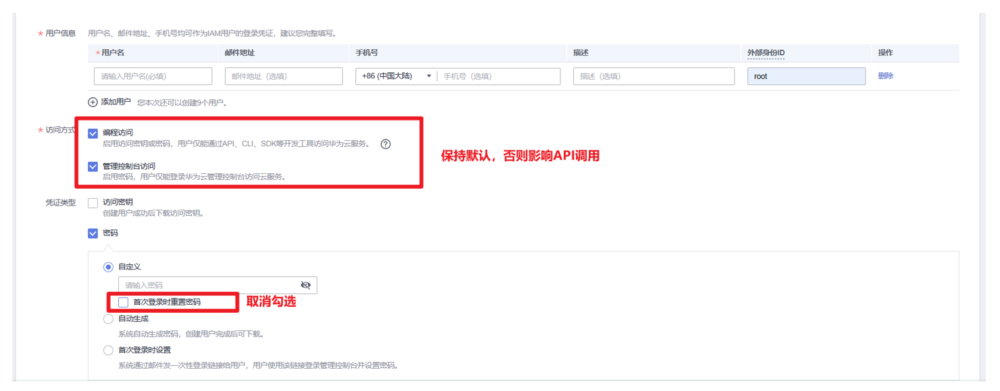

3. 创建成功后，退出登录华为云，使用IAM账号登录华为云，验证是否成功。

### 7.3 获取Token（小程序）

1. 参考华为云提供的请求示例，发送获取Token的http请求消息

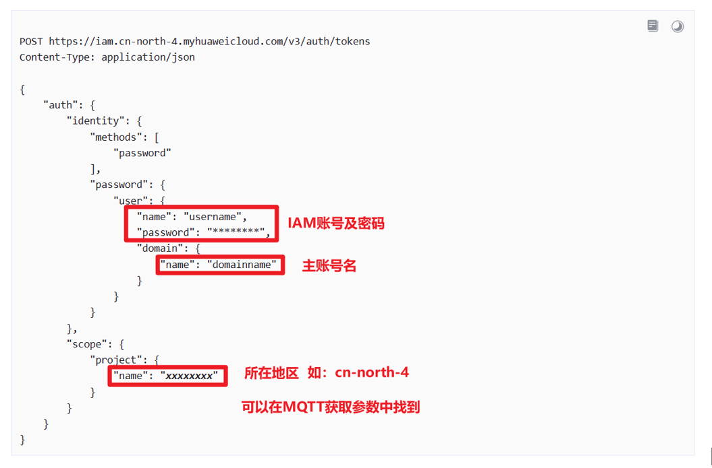

2. 华为云认证通过后向应用服务器返回鉴权令牌`X-Subject-Token`，接口返回的响应消息头中`X-Subject-Token`就是需要获取的用户Token。根据上述示例，在微信开发工具中，使用`wx.request`发送请求，然后分析响应消息头，获取Token。

```javascript
gettoken(){
    var that=this;   
    wx.request({
        url: 'https://iam.cn-north-4.myhuaweicloud.com/v3/auth/tokens',
        data:'{"auth": { "identity": {"methods": ["password"],"password": {"user": {"name": "***","password": "***","domain": {"name": "***"}}}},"scope": {"project": {"name": "cn-north-4"}}}}',
        method: 'POST', // OPTIONS, GET, HEAD, POST, PUT, DELETE, TRACE, CONNECT
        header: {'content-type': 'application/json' }, // 请求的 header 
        success: function(res){// success
            var token='';
            token=JSON.stringify(res.header['X-Subject-Token']);//解析消息头的token
            token=token.replaceAll("\"", "");
            wx.setStorageSync('token',token);
        },
    });
}

```

3. 获取Token后，再调用其他接口时，需要在请求消息头中添加`X-Auth-Token`，其值为获取到的Token。例如Token值为“ABCDEFJ....”，则调用接口时将“X-Auth-Token: ABCDEFJ....”加到请求消息头即可，如下所示。

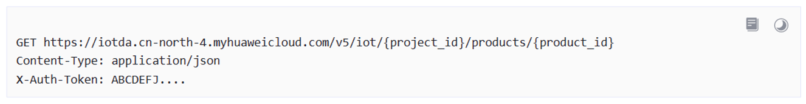

### 7.4 获取设备影子（小程序）

1. 参考请求示例，发送请求获取设备影子数据。

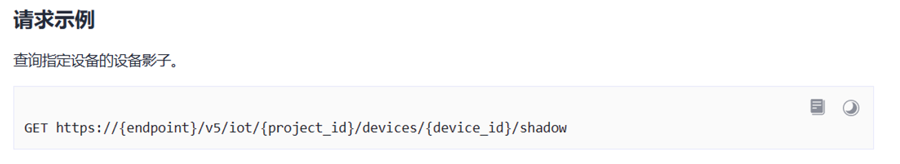

2. 查看返回的HTTP响应消息，查看所需要的数据所在位置，如下图所示，可以发现我们需要的数据在data里面的shadow[0]中的reported下的properties里面。

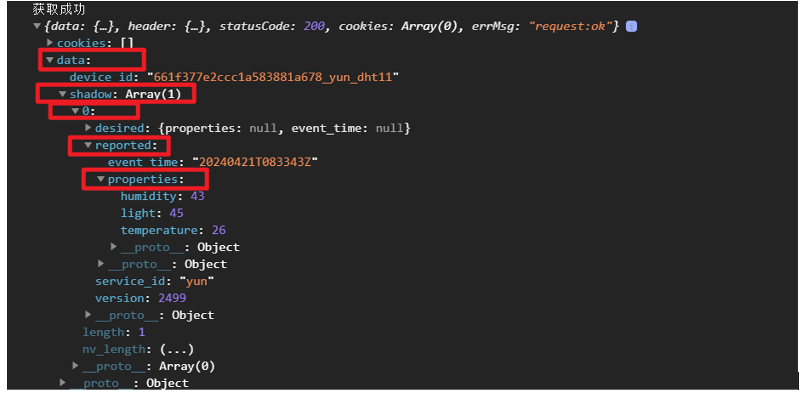

3. 根据分析的结果，在微信开发工具中编写代码，获取数据。

```js
getinfo(){
    var that = this
    var token = wx.getStorageSync('token');//读缓存中保存的token
      wx.request({
        url: 'https://653a151f50.st1.iotda-app.cn-north-4.myhuaweicloud.com:443/v5/iot/661f377e2ccc1a583881a678/devices/661f377e2ccc1a583881a678_yun_dht11/shadow',
        data:'',
        method: 'GET', // OPTIONS, GET, HEAD, POST, PUT, DELETE, TRACE, CONNECT
        header: {'content-type': 'application/json','X-Auth-Token':token },
      success: function (res) {
      that.setData({
        humi:res.data.shadow[0].reported.properties.humidity,
        temp:res.data.shadow[0].reported.properties.temperature,
        light:res.data.shadow[0].reported.properties.light
      })
      }
     });
}
```

### 7.5 下发设备命令（小程序）

参考请求示例，在微信开发工具中编写代码下发命令。

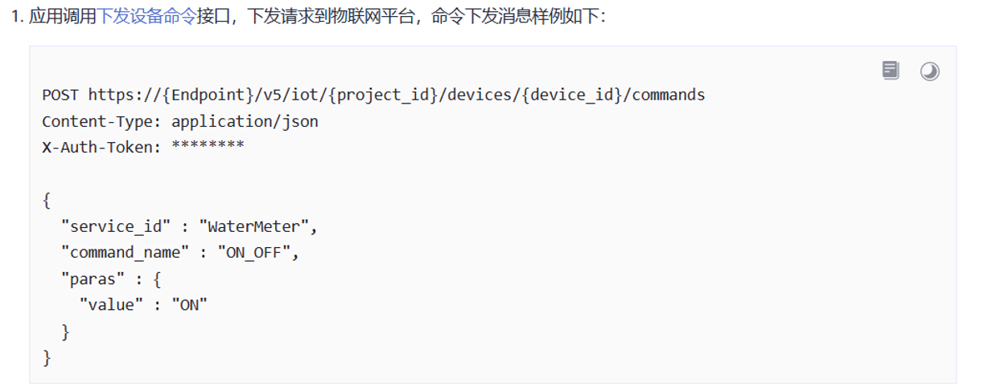

```js
if(that.data.lset > that.data.light){
    wx.request({
      url: 'https://653a151f50.st1.iotda-app.cn-north-4.myhuaweicloud.com:443/v5/iot/661f377e2ccc1a583881a678/devices/661f377e2ccc1a583881a678_yun_dht11/commands',
      data:'{"service_id": "yun","command_name": "led","paras": {"led_flag": true}}',
      method: 'POST', // OPTIONS, GET, HEAD, POST, PUT, DELETE, TRACE, CONNECT
      header: {'content-type': 'application/json','X-Auth-Token':token }, //请求的header 
      success: function(res){
          console.log("下发命令成功");//打印完整消息
      }, 
    });
}
```

## 8 小程序界面设计

### 8.1 主页数据显示

在wxml中设置布局，在wxss中设置样式，如下图所示。

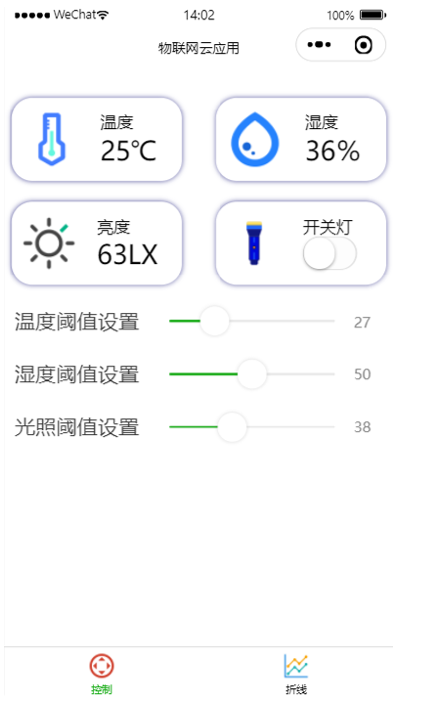

### 8.2 Echarts数据可视化

[ECharts](https://echarts.apache.org/zh/index.html)一个使用JavaScript实现的开源可视化库。ECharts提供了常规的折线图、柱状图、散点图、饼图、K线图，用于统计的盒形图，用于地理数据可视化的地图、热力图、线图，用于关系数据可视化的关系图、treemap、旭日图，多维数据可视化的平行坐标，还有用于BI的漏斗图，仪表盘，并且支持图与图之间的混搭。

微信小程序使用Echarts进行可视化的步骤如下所示。

1. 将Echarts下载到本地，并放入的微信小程序工程文件夹中，如下图所示。

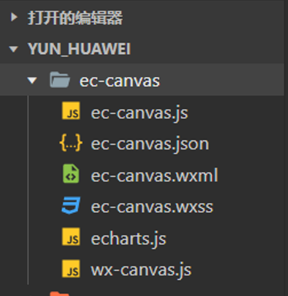

2. 在lineset.json中引入ec-canvas组件，如下图所示。

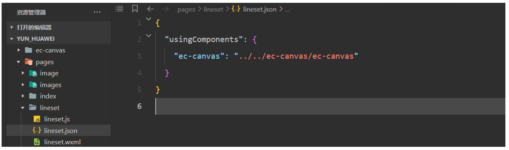

3. 参考官网给出的折线图堆叠示例，编写该图像的显示函数function line_set(chart,time_data,hum_data,tem_data,ligh_data)。

4. 初始化图表，同时调用line_set函数显示。

```js
init_chart: function (time_data,hum_data,tem_data,ligh_data) {        
    this.oneComponent.init((canvas, width, height, dpr) => {
        const chart = echarts.init(canvas, null, {
            width: width,
            height: height,
            devicePixelRatio: dpr 
        });
        line_set(chart,time_data,hum_data,tem_data,ligh_data)
        this.chart = chart;
        return chart;
    });
}
```

5. 将获得的影子设备的数据存入数组中，然后将其传入init_chart(date,humi,temp,ligh)中，进行数据实时可视化显示。

```js
temp = that.data.Temperature;
humi = that.data.Humidity;
ligh = that.data.Light;
date = that.data.Time;
temp.push(res.data.shadow[0].reported.properties.temperature);
humi.push(res.data.shadow[0].reported.properties.humidity);
ligh.push(res.data.shadow[0].reported.properties.light);
date.push(formattedTime);
if (temp.length > 7) {
  temp.shift(); // 移除数组的第一个元素
  humi.shift();
  ligh.shift();
  date.shift();
}
```
